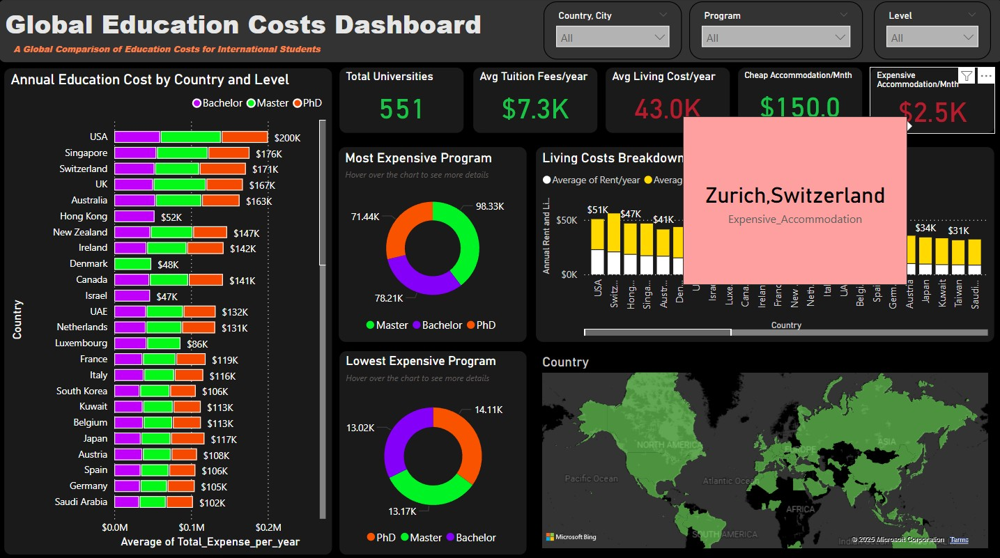
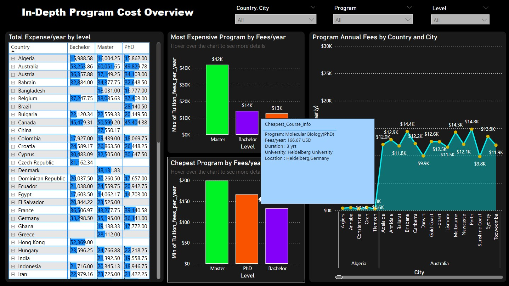

# 🌍 Global Education Cost Dashboard

This Power BI dashboard explores global education costs using data sourced from Kaggle. The dashboard provides insights into tuition fees, living costs, and total annual education expenses across countries, cities, and program levels.

## 📊 Dashboard Overview

The report consists of **2 main pages** and **6 tooltip pages**:

### Page 1: Education Cost Overview
- **Annual Education Cost** breakdown by **country** and **program level**
- Highlights of:
  - **Most Expensive Programs**
  - **Cheapest Programs**
- Tooltip page for detailed insights per program
- **Living Cost Breakdown**:
  - Segregated by **rent** and **living expenses**
  - Interactive **world map**
- **5 KPI Cards**:
  - Total Universities
  - Average Tuition Fees
  - Average Living Costs
  - Cheapest Options
  - Accommodation Stats
- Some KPI is linked to its **own tooltip page**
- **Filters Available**:
  - Country & City
  - Program
  - Level

### Page 2: Program Cost Deep Dive
- Detailed comparison of **program tuition fees**
- Dynamic **line chart** showing annual program cost by **country and city**
- **Table of Total Expenses per Year** categorized by program level
- Spotlight on:
  - **Most Expensive Programs**
  - **Cheapest Programs**
- Linked tooltip pages for further exploration
- **Same 3 filters**: Country & City, Program, Level

## 🗂 Dataset Source

- Kaggle Dataset: [Link to the dataset](#) <!-- Replace # with actual Kaggle URL -->

## 📁 Files in This Repo

- `Global_Education_Cost_Dashboard.pbix`: Power BI dashboard file
- `dashboard_screenshot`: Global education cost dash board page 1, Global education cost dash board page 2
### Page 1 Preview

### Page 2 Preview

## 🧠 Key Insights

- Compare costs of higher education globally with context-aware filters.
- Understand how living costs impact total education expenses.
- Identify affordable and premium programs across regions.

---

Feel free to clone the repo and customize the dashboard to suit your own analysis needs. 📈
